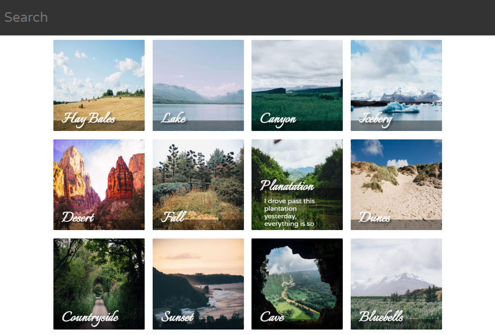
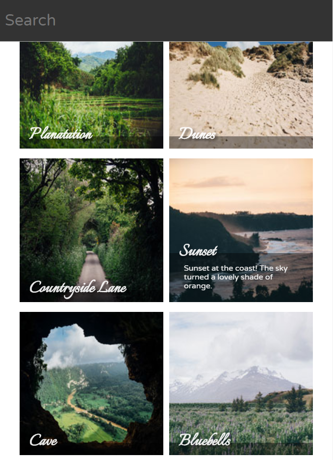
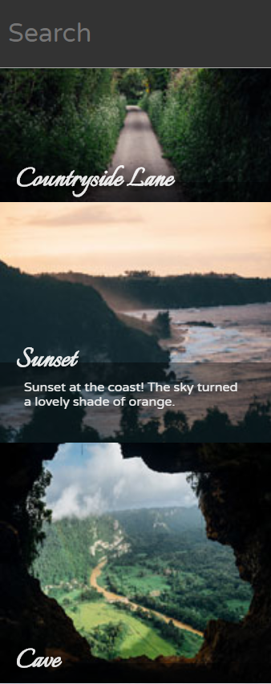
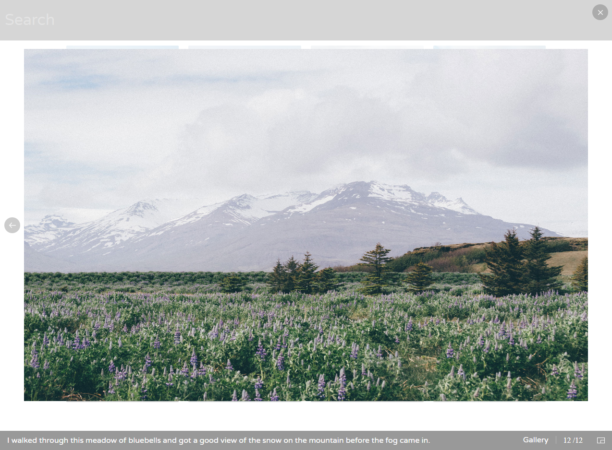

# Interactive Gallery
This was the project #5 of the [Treehouse Front End Web Development Techdegree](https://teamtreehouse.com/techdegree/front-end-web-development-2).

## Instruction From Treehouse
- In this project, you will create an interactive photo gallery using JavaScript and jQuery. Thumbnails and photos will be provided with descriptions. At the top of the page, you'll have a search area where photos will hide and show depending on user input. When the user clicks on a thumbnail, the photo will display in a lightbox. There should be a back and previous arrows to cycle through photos.

## Provided Content In This Project
- Photos
- Photo thumbnails
- Photo captions
- Gallery site mockup
- Lightbox interface mockup

## Library
- [jQuery-3.3.1](https://jquery.com/download/)

## Plugins
- [Choloat (a free jquery lightbox plugin)](http://chocolat.insipi.de/)

## Screenshots

Desktop

    

Tablet

    

Phone

    

Lightbox UI

    

